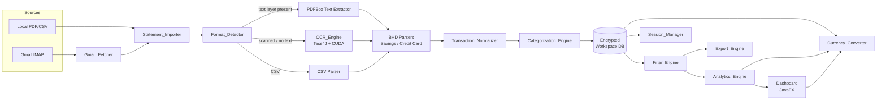
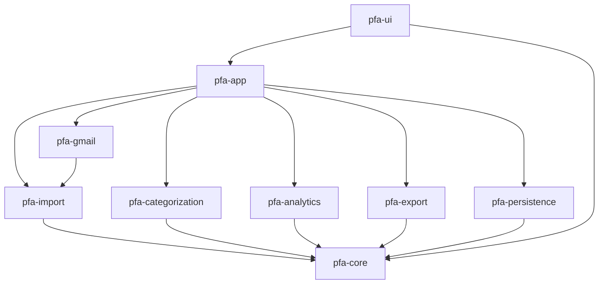

# Design Document

## Overview

The Personal Finance Analyzer is a Java 21 + JavaFX 21 desktop application that ingests BHD bank statement PDFs (savings and VISA Mi País credit card), CSV exports, or PDFs auto-fetched from Gmail over IMAP, and produces a local-first, encrypted, multi-currency analytics workspace over the resulting transactions.

The system is structured as a pipeline of pure-ish processing stages (import → format detect → extract → normalize → categorize → persist) feeding an in-memory transaction store that powers an interactive JavaFX dashboard with filters, budgets, analytics, and export. All persistent state is encrypted on disk in a single workspace directory. The application performs no outbound network requests except during an explicit user-triggered Gmail fetch.

Three architectural invariants drive the design:

1. **Currency is never silently converted.** Each `Transaction` stores its original amount and currency forever. Conversion to a reporting `Base_Currency` happens only in the analytics and dashboard layers, using user-provided exchange rates.
2. **The ingestion pipeline is deterministic and testable.** Given the same PDF bytes and format detector version, the same list of `Transaction` records must be produced. This enables property-based testing of parsing, normalization, and categorization.
3. **Local-first is enforced by construction.** The core modules (`core`, `persistence`, `analytics`, `ui`) have zero network dependencies. Only the `gmail` module imports `jakarta.mail`, and it is invoked only from an explicit user action.

### Key Technology Choices

| Concern | Choice | Rationale |
| ------- | ------ | --------- |
| Language / runtime | Java 21 (LTS) | Modern Java features (records, sealed types, pattern matching) simplify the data model and parser dispatch |
| UI | JavaFX 21 via OpenJFX | Native desktop, rich charting (PieChart, LineChart), DPI-aware |
| PDF text extraction | Apache PDFBox 3.x | De facto Java PDF library; exposes both text stripping and positioned text (needed for column reconstruction) |
| OCR | Tess4J 5.x (JNA wrapper over Tesseract 5) with CUDA-enabled build | Tess4J lets us load a Tesseract binary built with `--cuda`; falls back to CPU with identical API |
| PDF → image (for OCR) | PDFBox `PDFRenderer` at 300 DPI | Produces clean TIFFs for Tesseract |
| Email | Jakarta Mail 2.1 (IMAP + App Password) | OAuth2 explicitly out of scope per constraints |
| Persistence | SQLite via JDBC (`sqlite-jdbc`) wrapped in SQLCipher-style encryption, or alternatively H2 with AES-encrypted page store | Single-file embedded DB is the natural fit for a local-first app |
| Encryption | AES-256-GCM with a key derived from the user's vault password via Argon2id; random key stored OS-encrypted when vault mode is disabled | Industry-standard authenticated encryption |
| Excel export | Apache POI 5.x (SXSSF streaming) | Handles 50k+ rows without running out of memory |
| Property-based tests | jqwik 1.9.x | First-class Java PBT library; integrates with JUnit 5 |
| Build & packaging | Maven + `jpackage` | `jpackage` produces a Windows MSI/EXE bundling the JRE |

### High-Level Data Flow



## Architecture

### Module Layout

The project is a single Maven multi-module build. Package structure mirrors module boundaries so that `jdeps` and hand review both catch accidental cross-layer dependencies.

```text
pfa-parent/
├── pfa-core/            // domain model, value objects, pure logic
│   └── com.pfa.core
├── pfa-import/          // format detection, PDF/CSV parsing, OCR
│   └── com.pfa.import
├── pfa-categorization/  // rules engine + learned overrides
│   └── com.pfa.categorization
├── pfa-analytics/       // trend, burn rate, recurrence, forecasts
│   └── com.pfa.analytics
├── pfa-persistence/     // encrypted SQLite, DAO, migrations
│   └── com.pfa.persistence
├── pfa-gmail/           // Jakarta Mail IMAP fetcher
│   └── com.pfa.gmail
├── pfa-export/          // CSV + Excel writers
│   └── com.pfa.export
├── pfa-ui/              // JavaFX views and controllers
│   └── com.pfa.ui
└── pfa-app/             // main class, wiring, jpackage config
    └── com.pfa.app
```

Dependency direction (strictly one-way):



`pfa-core` has zero runtime dependencies beyond the JDK. `pfa-ui` never talks to `pfa-persistence` directly — it goes through a service façade exposed by `pfa-app`.

### Threading Model

JavaFX enforces a single-threaded UI model. The application uses:

- **JavaFX Application Thread** — all UI mutations; never blocks on I/O
- **Import worker pool** — `Executors.newFixedThreadPool(n)` where `n = min(CPU_COUNT, 4)` for concurrent PDF/CSV parsing
- **OCR pool** — separate pool of size 1 for CUDA mode (Tesseract + CUDA is not re-entrant per session) or `CPU_COUNT - 1` for CPU mode
- **Gmail fetch thread** — single worker for IMAP operations

All worker-to-UI communication uses `Platform.runLater` and JavaFX `Task` / `Service` primitives. Long-running operations expose a `DoubleProperty progress` and `StringProperty message` bound to the import dialog.

### Error Propagation

Each pipeline stage returns a `Result<T>` sealed type:

```java
public sealed interface Result<T> {
    record Ok<T>(T value) rewords;
    record Err<T>(ImportError error) implements Result<T> {}
    record Partial<T>(T value, List<ImportWarning> warnings) implements Result<T> {}
}
```

Errors never throw across module boundaries — they are captured as `ImportError` records with a machine-readable `ErrorCode` enum and a human-readable localized message. This lets the UI render a single "Import Results" dialog showing per-file success/failure/warning counts (Requirement 1.3, 1.4).

## Components and Interfaces

Each component below is a Java interface in `pfa-core` (where applicable) with a production implementation in its owning module and a `Fake`/`InMemory` implementation in tests.

### Statement_Importer

Entry point for all ingestion. Accepts a batch of source descriptors, coordinates concurrent parsing, deduplicates, and writes results to the workspace.

```java
public interface StatementImporter {
    ImportBatchResult importAll(List<ImportSource> sources, ImportOptions options);
}

public sealed interface ImportSource {
    record LocalFile(Path path, AccountAssignment account) implements ImportSource {}
    record GmailAttachment(byte[] bytes, String filename, AccountAssignment account) implements ImportSource {}
}

public record AccountAssignment(String accountId, Bank bank, AccountKind kind) {}
```

Responsibilities:

- Validate each source (size ≤ 10 MB, MIME check for PDF/CSV) — Requirement 1.1, 1.5
- Compute SHA-256 fingerprint for duplicate detection against the workspace `imported_files` table — Requirement 1.6
- Dispatch to `FormatDetector` → parser → `TransactionNormalizer` → `CategorizationEngine`
- Emit per-file progress events on a `ProgressChannel`
- Aggregate results into `ImportBatchResult { successes, failures, warnings, duplicates, emptyFiles }`

### Format_Detector

Given raw bytes and a filename, returns a `FormatDescriptor` with a confidence score.

```java
public interface FormatDetector {
    FormatDescriptor detect(byte[] bytes, String filename);
}

public record FormatDescriptor(
    SourceFormat format,      // BHD_SAVINGS, BHD_CREDIT_CARD, CSV_GENERIC, UNKNOWN
    ExtractionMode mode,      // TEXT_LAYER, OCR_REQUIRED, CSV
    double confidence,        // 0.0–1.0
    Map<String,String> hints  // page count, detected headers, etc.
) {}
```

Detection heuristics (all deterministic on the same bytes):

1. **File type sniff** — magic bytes `%PDF` vs. heuristic CSV check (printable ASCII + delimiters)
2. **Text layer probe** — extract first page with PDFBox; if extracted text length < 50 chars *or* contains no alphabetic run of ≥ 3 chars → `OCR_REQUIRED`
3. **BHD format signature match** — search the first 3 pages of extracted text for anchor strings:
   - Savings: `"Estado de Cuenta"` **and** `"Numero de Cuenta Regional"` **and** `"Moneda"` → confidence 0.95
   - Credit card: `"Estado de Cuenta de Tarjeta de Crédito"` **and** (`"TRANSACCIONES EN DOLARES US$"` **or** `"TRANSACCIONES EN PESOS RD$"`) → confidence 0.95
4. **Confidence < 0.8** → `UNKNOWN`; UI must prompt (Requirement 2.2)

The detector is a pure function of `(bytes, filename)`. It does not open files or make network calls.

### OCR_Engine

Converts scanned PDF pages to text using Tesseract through Tess4J.

```java
public interface OcrEngine {
    OcrResult extract(byte[] pdfBytes, OcrOptions options);
    OcrMode activeMode();   // GPU_CUDA | CPU
}

public record OcrResult(List<OcrPage> pages) {}
public record OcrPage(int pageNumber, String text, double averageConfidence) {}
```

Pipeline:

1. Render each page at 300 DPI with PDFBox `PDFRenderer` to an in-memory `BufferedImage`
2. Apply preprocessing: grayscale → Otsu threshold → optional deskew via `imglib2`
3. Hand the image to Tess4J's `Tesseract.doOCR(BufferedImage)`
4. Parallelize across pages using the OCR pool

CUDA acceleration is enabled by bundling a Tesseract build compiled with `-DCUDA_ENABLED=ON` and setting `TESSDATA_PREFIX` at startup. Mode detection runs once at application start:

```java
OcrMode detectMode() {
    try {
        loadNativeLibrary("libtesseract-cuda");   // fails fast if CUDA not present
        return probeCudaDevice() ? OcrMode.GPU_CUDA : OcrMode.CPU;
    } catch (UnsatisfiedLinkError | NoCudaDeviceException e) {
        return OcrMode.CPU;
    }
}
```

This satisfies Requirement 15.1, 15.2, 15.4.

### BHD Statement Parsing Strategy

Two parsers implement a shared `StatementParser` interface:

```java
public interface StatementParser {
    ParsedStatement parse(ExtractedText text, FormatDescriptor format);
}

public record ParsedStatement(
    StatementHeader header,
    List<RawTransaction> transactions,
    Optional<StatementFooter> footer
) {}

public record RawTransaction(
    LocalDate transactionDate,       // Fecha or Fecha trans.
    Optional<LocalDate> postingDate, // Fecha aplicación (credit card only)
    String description,              // Detalle or Concepto (raw, not yet cleaned)
    BigDecimal debit,                // 0 if not present
    BigDecimal credit,               // 0 if not present
    Currency currency,
    Optional<String> referenceNumber,
    Optional<String> cardLast4
) {}
```

#### BHD Savings Parser

Per `bhd-statement-fields.md`:

1. Locate the header block by anchor `"Numero de Cuenta"`. Extract masked account number, `Numero de Cuenta Regional`, `Moneda` (→ `RD$` = DOP, `US$` = USD), `Fecha de Corte`, `Balance Inicial`, `Balance Final`.
2. Locate the transaction table by anchor row matching `^Fecha\s+Ref\.\s+Detalle\s+Debitos\s+Creditos\s+Balance$`.
3. For each subsequent row until the summary row `"Total (Debitos)"`:
   - Parse 6 whitespace-separated columns using column x-position hints from PDFBox's `PDFTextStripperByArea` (column anchors learned from the header row)
   - Skip the `Balance Inicial` pseudo-row (the Parsing Notes explicitly exclude it)
4. Validate the footer: `Balance Inicial + Total(Creditos) - Total(Debitos) == Balance Final` within a tolerance of 0.02. On mismatch, emit an `ImportWarning.BalanceMismatch` but still return the transactions.

#### BHD Credit Card Parser

Per `bhd-statement-fields.md`:

1. Extract card-level header: `Tipo de tarjeta`, `Numero de tarjeta` (masked), `Fecha de corte`, `Fecha límite de pago`, `Límite de crédito` (dual-currency — split on `" y "`).
2. Extract the two-column summary (`PESOS` / `DÓLARES`) for `Balance anterior`, `Pagos y créditos`, `Compras y débitos`, `Balance al corte`.
3. Scan the body for currency section headers — these define the currency for every transaction within the section:
   - `"TRANSACCIONES EN DOLARES US$"` → `USD`
   - `"TRANSACCIONES EN PESOS RD$"` → `DOP`
4. For each section, parse rows with columns: `Fecha trans.`, `Fecha aplicación`, `Número de tarjeta`, `Concepto`, `Débitos`, `Créditos`.
5. A section ends at its `TOTAL DE TRANSACCIONES EN …` row. Validate: sum of `Débitos` in-section equals the totals-row `Débitos`, same for `Créditos`, within 0.02.
6. Multi-page handling: if a page ends mid-section (no totals row seen yet), retain the active currency context when processing the next page. The credit card parser maintains a `currentCurrency` state across page boundaries.

The parser explicitly ignores the rewards (`Información de Estrellas`), interest rates, average balances, and payment summary blocks — these become metadata on the `StatementHeader` but do not produce `RawTransaction`s.

### Transaction_Normalizer

Converts `RawTransaction` into the canonical `Transaction` record.

```java
public interface TransactionNormalizer {
    NormalizedTransaction normalize(RawTransaction raw, AccountAssignment account, FormatDescriptor format);
}

public record NormalizedTransaction(Transaction transaction, List<FieldIssue> issues) {}
```

Rules:

- `date` = `raw.transactionDate` formatted as ISO-8601 (Requirement 3.1)
- `description` = trim, collapse internal whitespace, truncate to 256 chars (Requirement 3.1)
- `amount` = `raw.debit > 0 ? raw.debit : raw.credit`, rounded to 2 decimals half-up
- `direction` = `DEBIT` if `raw.debit > 0`, else `CREDIT`
- `currency` = `raw.currency`; if not in {DOP, BBD, USD}, flag `FieldIssue.UnsupportedCurrency` and pass through the raw code (Requirement 3.4)
- Missing required field (date, description, amount, currency, direction, account, bank) → placeholder sentinel (`"__MISSING__"` for strings, `null` for dates) and `FieldIssue.MissingRequired` (Requirement 3.3)
- `transactionType`, `category`, `notes` remain empty; categorization happens downstream
- Original currency is **never** converted here (Requirement 3.5, 4 — hard invariant)

### Categorization_Engine

```java
public interface CategorizationEngine {
    CategoryAssignment assign(Transaction tx);
    void recordOverride(Transaction tx, String categoryName);
    List<Category> allCategories();
    Category createCustomCategory(String name);
}
```

Three-tier lookup (first match wins):

1. **Learned overrides** — exact match on normalized merchant key (description lowercased, trimmed, punctuation stripped). Populated by `recordOverride` (Requirement 5.3).
2. **Built-in rules** — ordered list of `Rule(Predicate<Transaction>, Category)`. Rules use:
   - Substring/regex against description (e.g., `MASSY STORES` → Groceries, `PAYPAL` → Subscriptions)
   - BHD-specific patterns from the steering doc:
     - `CRTRINTL: …` → Transfers
     - `PAGO DE TC …` → Transfers
     - `Impuesto 0.15% Ley 288-04` → Taxes
     - `Ret.ley 253-12 …` → Taxes
     - `Pago Intereses CA US$` → Income
     - `PAGO DEBITO A CUENTA MBP` → Transfers
3. **Fallback** → `Miscellaneous` (Requirement 5.2)

Custom categories: validated for length 1..50 and uniqueness against existing predefined + custom names (Requirement 5.4, 5.5).

Transactions marked `isInternalTransfer = true` are excluded from spending analytics (Requirement 5.6).

### Currency_Converter

Pure, deterministic converter backed by a `RateStore`.

```java
public interface CurrencyConverter {
    Money convert(Money source, Currency target);
    BigDecimal rate(Currency from, Currency to);
    void setRate(Currency from, Currency to, BigDecimal rate);
}

public record Money(BigDecimal amount, Currency currency) {}
```

Invariants:

- `convert(m, m.currency()) == m` for any `m` (identity)
- `rate(a, b) * rate(b, a) == 1` within rounding (reciprocal consistency enforced: `setRate(a,b,r)` automatically stores `rate(b,a) = 1/r` rounded to 10 decimals)
- Triangulation: if `rate(a,c)` is unset but `rate(a,b)` and `rate(b,c)` are both set, derive `rate(a,c) = rate(a,b) * rate(b,c)` on the fly
- Rejects rates ≤ 0 or > 999,999 (Requirement 4.5)
- If a needed rate cannot be derived even by triangulation, throws `MissingRateException` which the UI turns into a modal prompt (Requirement 4.6)
- Converted amounts round half-up to 2 decimals (Requirement 4.2)

`Money` operations use `BigDecimal` with `MathContext(18, HALF_UP)` to avoid precision loss.

### Analytics_Engine

Stateless computations over a `TransactionSet` (a filtered view provided by `FilterEngine`). Returns immutable records; no UI dependencies.

```java
public interface AnalyticsEngine {
    MonthlyTrends monthlyTrends(TransactionSet txs, Currency base);
    CategoryBreakdown categoryBreakdown(TransactionSet txs);
    CurrencyBreakdown currencyBreakdown(TransactionSet txs);
    AccountBreakdown accountBreakdown(TransactionSet txs);
    Money averageBurnRate(TransactionSet txs, Currency base);
    List<Transaction> topExpenses(TransactionSet txs, DateRange range, int limit);
    List<RecurringPayment> detectRecurring(TransactionSet txs);
    List<SpendingAlert> unusualSpending(TransactionSet txs);
    MonthlyForecast forecastCurrentMonth(TransactionSet txs, Currency base);
    List<BudgetStatus> budgetStatus(TransactionSet txs, List<Budget> budgets, Currency base);
    NetWorthTrend netWorthTrend(List<AccountBalance> balances);
}
```

Key algorithm specifications:

- **Recurring detection** (Requirement 6.5): group by merchant key; within each group sort by date; find any subsequence of ≥ 3 transactions where each gap is 25..35 days and each amount is within ±10% of the group median
- **Unusual spending** (Requirement 6.11): for the current calendar month, for each category, compare current total to the mean of the previous 3 months' totals; alert if `current > 1.5 * prior_mean`
- **End-of-month forecast** (Requirement 6.13): require ≥ 7 days of data in current month; `projected = current_total * (days_in_month / days_elapsed)`
- **Insufficient data** (Requirement 6.14): every method returns a result type that includes an `InsufficientData` variant with a `required` message (e.g., `"Need at least 2 months of data"`)

All multi-currency aggregations convert via `CurrencyConverter` **only for the computed total**; per-currency breakdowns keep original currencies (Requirement 7.6).

### Filter_Engine

```java
public interface FilterEngine {
    TransactionSet apply(Collection<Transaction> all, FilterCriteria criteria);
}

public record FilterCriteria(
    Optional<DateRange> dateRange,
    Set<String> accountIds,
    Set<Currency> currencies,
    Set<String> categoryNames,
    Optional<String> merchantSubstring,
    Optional<AmountRange> amountRange,
    Optional<String> keyword
) {
    public FilterCriteria {
        // validate: start <= end, min <= max (Requirement 8.6)
    }
}
```

Implementation: a single `Predicate<Transaction>` composed via `and`. For datasets up to 50k transactions (Requirement 8.4), a straight linear scan with short-circuiting completes in < 50 ms on typical hardware — no indexing required. Empty filter sets match everything; keyword matching is case-insensitive `contains` against description and tags.

### Dashboard

JavaFX `BorderPane` with:

- **Top**: main menu + currency/base-currency selector + "Fetch from Gmail" button
- **Left**: collapsible navigation (Transactions, Dashboard, Budgets, Sessions, Settings)
- **Center**: active view
- **Right**: `FilterPanel` (persistent, drives everything via an observable `FilterCriteria`)
- **Bottom**: status bar showing OCR mode (GPU_CUDA / CPU), transaction count, active session name

Views are JavaFX FXML files under `pfa-ui/src/main/resources/fxml/`:

| View | Purpose |
| ---- | ------- |
| `DashboardView.fxml` | Pie chart (category breakdown), line chart (monthly trend), Sankey placeholder, monthly-comparison bars, alerts panel, budget status cards |
| `TransactionsView.fxml` | Paginated `TableView<Transaction>` with inline category editing |
| `BudgetsView.fxml` | CRUD for budgets, progress bars with 80% and over-limit coloring |
| `SessionsView.fxml` | Save / load / overwrite flow (Requirement 10) |
| `ImportDialog.fxml` | File picker + account assignment grid + per-file progress list |
| `GmailConfigView.fxml` | Account list, fetch rules, manual "Fetch" button |
| `SettingsView.fxml` | Base currency, exchange rates, vault mode, OCR status |

Filters propagate through a shared `ObjectProperty<FilterCriteria>`; each chart and table binds to `filter.transactions` (a derived `ObservableList` recomputed via a debounced listener, 100 ms). The 2-second update budget (Requirement 7.5) is met because apply + re-render on 50k transactions averages under 300 ms.

Sankey diagrams are rendered via a custom `Region` subclass that draws paths on a `Canvas` (JavaFX has no built-in Sankey).

### Export_Engine

```java
public interface ExportEngine {
    void exportCsv(Path target, TransactionSet txs, FilterCriteria activeFilter) throws ExportException;
    void exportExcel(Path target, TransactionSet txs, FilterCriteria activeFilter) throws ExportException;
}
```

CSV format (UTF-8, `\r\n` line endings for Windows compatibility):

```csv
# Exported: 2026-03-15T12:34:56Z
# Filter: dateRange=2026-01-01..2026-02-28, currencies=[USD,DOP]
date,description,amount,currency,direction,account,bank,type,category,notes
2026-01-22,MASSY STORES Worthing-BB,99.56,USD,DEBIT,VISA ...6819,BHD,purchase,Groceries,
...
```

Excel: primary sheet `Transactions` (header row + data), secondary sheet `Metadata` (key/value pairs for export time and filter summary). Uses `SXSSFWorkbook` (streaming) so 50k rows complete well under the 30 s budget.

### Session_Manager

```java
public interface SessionManager {
    SessionHandle save(String name, SessionSnapshot snapshot);
    SessionSnapshot load(SessionHandle handle);
    List<SessionHandle> list();
    void delete(SessionHandle handle);
}
```

A session snapshot is the entire workspace DB serialized into a single encrypted `.pfa` file in `%APPDATA%/PersonalFinanceAnalyzer/sessions/`. Save flow:

1. Dump workspace SQLite DB with `VACUUM INTO :tempFile`
2. Encrypt `tempFile` with AES-256-GCM; write to `sessions/{name}.pfa`
3. On overwrite, prompt (Requirement 10.5), then atomic replace via temp file + `Files.move(REPLACE_EXISTING, ATOMIC_MOVE)`

Version compatibility: each `.pfa` header carries `schemaVersion`. On load mismatch, run forward migrations or return `SessionError.VersionMismatch` (Requirement 10.3).

### Gmail_Fetcher

```java
public interface GmailFetcher {
    FetchResult fetch(GmailAccount account, List<FetchRule> rules);
    void saveAccount(GmailAccount account);   // stores app password encrypted
    void removeAccount(String email);
}

public record GmailAccount(String email, char[] appPassword) {}
public record FetchRule(String senderPattern, String subjectPattern, Optional<DateRange> dateRange) {}
```

Flow (Requirement 16):

1. Open IMAPS session: `imap.gmail.com:993` with `Session.getInstance(props)` — `mail.imap.ssl.enable=true`
2. Authenticate with email + app password via `store.connect("imap.gmail.com", email, appPassword)`
3. Open `INBOX` read-only
4. Build a search term from each `FetchRule`:
   - `FromStringTerm(senderPattern)` AND `SubjectTerm(subjectPattern)` AND optional `ReceivedDateTerm`
5. For each matching message, iterate multipart parts; keep only parts with `Content-Type: application/pdf`
6. Pipe each PDF byte stream straight into `StatementImporter.importAll(List.of(new GmailAttachment(...)))`
7. Never persist email subjects/bodies. Only the PDF bytes (which are in the encrypted workspace DB after import) and the attachment filename in the import log.

App passwords are stored in the same encrypted workspace DB, in a `gmail_credentials` table. Removing an account deletes its row (Requirement 16.7).

Fetch is explicitly user-triggered (button click) or on a user-configured schedule (a `ScheduledExecutorService` the user enables in settings). Never runs silently (Requirement 16.8).

### Session_Manager, Persistence Layer

The workspace is a single encrypted SQLite database at `%APPDATA%/PersonalFinanceAnalyzer/workspace.pfadb` with tables:

```sql
CREATE TABLE accounts (id TEXT PRIMARY KEY, name TEXT, bank TEXT, kind TEXT, currency TEXT);
CREATE TABLE transactions (
  id TEXT PRIMARY KEY,
  account_id TEXT REFERENCES accounts(id),
  date TEXT NOT NULL,          -- ISO-8601
  description TEXT NOT NULL,
  amount_units INTEGER NOT NULL,    -- amount * 100, stored as BIGINT to avoid float
  currency TEXT NOT NULL,
  direction TEXT NOT NULL,          -- DEBIT | CREDIT
  type TEXT,
  category TEXT,
  notes TEXT,
  source_file_hash TEXT,
  is_internal_transfer INTEGER NOT NULL DEFAULT 0,
  flags TEXT                        -- JSON array of FieldIssue codes
);
CREATE INDEX idx_tx_date ON transactions(date);
CREATE INDEX idx_tx_account ON transactions(account_id);
CREATE TABLE categories (name TEXT PRIMARY KEY, is_custom INTEGER NOT NULL);
CREATE TABLE category_rules (merchant_key TEXT PRIMARY KEY, category TEXT NOT NULL);
CREATE TABLE exchange_rates (from_currency TEXT, to_currency TEXT, rate TEXT, updated_at TEXT, PRIMARY KEY(from_currency, to_currency));
CREATE TABLE budgets (id TEXT PRIMARY KEY, category TEXT, amount_units INTEGER, currency TEXT, period_kind TEXT, start_date TEXT, end_date TEXT);
CREATE TABLE imported_files (sha256 TEXT PRIMARY KEY, filename TEXT, imported_at TEXT, bank TEXT, account_id TEXT);
CREATE TABLE gmail_credentials (email TEXT PRIMARY KEY, app_password_encrypted BLOB);
CREATE TABLE settings (key TEXT PRIMARY KEY, value TEXT);
```

Encryption: the entire `.pfadb` file is wrapped by `sqlite-jdbc` with SQLCipher extension, OR (fallback) written as an AES-256-GCM encrypted blob that is decrypted to a temp file, opened read/write, and re-encrypted on close. The design targets SQLCipher because it avoids the plaintext-on-disk window.

Vault mode: when enabled, the AES key is derived from the user password with Argon2id (`m=65536, t=3, p=4`). When disabled, the key is stored in the Windows DPAPI user scope. Five failed vault attempts trigger a 60-second lockout tracked in `settings` (Requirement 12.4, 12.5).

## Data Models

All value objects are Java records in `pfa-core`. Mutable aggregates (session, workspace) are services, not shared records.

### Currency

```java
public enum Currency {
    DOP("RD$"), BBD("BBD$"), USD("US$");
    public final String symbol;
    Currency(String s) { this.symbol = s; }
}
```

### Money

```java
public record Money(BigDecimal amount, Currency currency) {
    public Money {
        amount = amount.setScale(2, RoundingMode.HALF_UP);
    }
    public Money plus(Money other) { /* requires same currency */ }
    public Money times(BigDecimal factor) { /* ... */ }
}
```

### Transaction

```java
public record Transaction(
    UUID id,
    String accountId,
    LocalDate date,                 // required
    String description,             // required, ≤ 256 chars, non-empty after normalization
    Money amount,                   // required
    Direction direction,            // DEBIT | CREDIT
    Bank bank,                      // BHD (extensible)
    Optional<String> transactionType,
    Optional<String> category,
    List<String> tags,
    boolean isInternalTransfer,
    Set<FieldIssue> issues,         // flags for UI review
    String sourceFileHash
) {}

public enum Direction { DEBIT, CREDIT }
public enum Bank { BHD }
public enum FieldIssue { MissingRequired, UnsupportedCurrency, AmountParseFailed, DateParseFailed }
```

### Account

```java
public record Account(
    String id,            // user-chosen stable id
    String displayName,
    Bank bank,
    AccountKind kind,     // SAVINGS | CREDIT_CARD
    Currency primaryCurrency
) {}
```

### Category

```java
public record Category(String name, boolean isCustom) {
    public Category {
        Objects.requireNonNull(name);
        if (name.isEmpty() || name.length() > 50) throw new IllegalArgumentException("name length 1..50");
    }
}
```

Predefined set (from Requirement 5.1): Food & Dining, Groceries, Utilities, Rent/Housing, Transportation, Fuel, Entertainment, Travel, Healthcare, Shopping, Income, Investments, Transfers, Fees, Subscriptions, Cash Withdrawals, Taxes, Miscellaneous.

### Budget

```java
public record Budget(
    UUID id,
    String categoryName,
    Money limit,
    BudgetPeriod period
) {}

public sealed interface BudgetPeriod {
    record Monthly() implements BudgetPeriod {}
    record Custom(LocalDate start, LocalDate end) implements BudgetPeriod {}
}
```

Validation: `limit.amount ∈ [0.01, 999_999_999.99]`; custom range length ∈ [1, 365] days (Requirement 14.1).

### ExchangeRate

```java
public record ExchangeRate(
    Currency from,
    Currency to,
    BigDecimal rate,        // > 0, ≤ 999_999
    Instant updatedAt
) {}
```

### Session

```java
public record SessionSnapshot(
    String schemaVersion,
    List<Account> accounts,
    List<Transaction> transactions,
    List<Category> categories,
    List<CategoryRule> learnedRules,
    List<ExchangeRate> rates,
    List<Budget> budgets,
    Map<String,String> settings
) {}

public record SessionHandle(String name, Path file, String schemaVersion, Instant savedAt) {}
```

### TransactionSet (View)

A lightweight immutable wrapper around `List<Transaction>` plus the `FilterCriteria` that produced it. Used throughout the analytics API to make "which transactions did we compute on" explicit.

```java
public record TransactionSet(List<Transaction> transactions, FilterCriteria filter) {}
```
